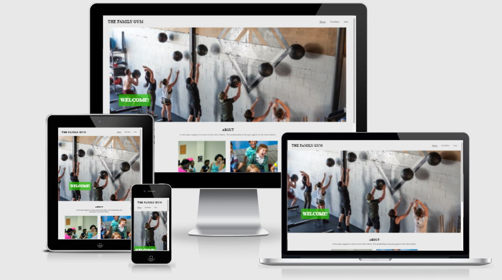
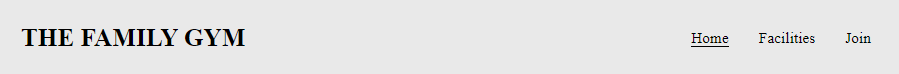
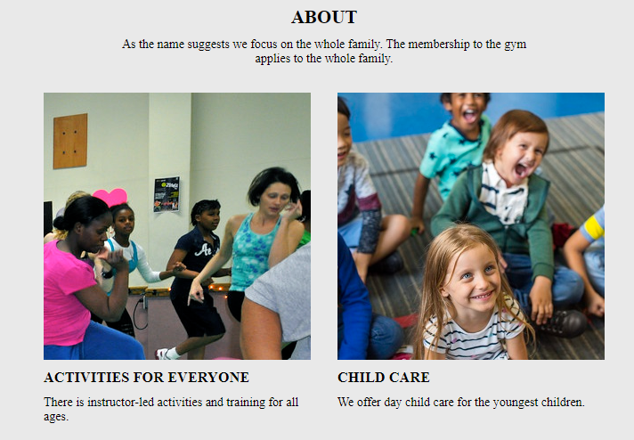
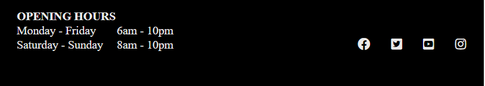
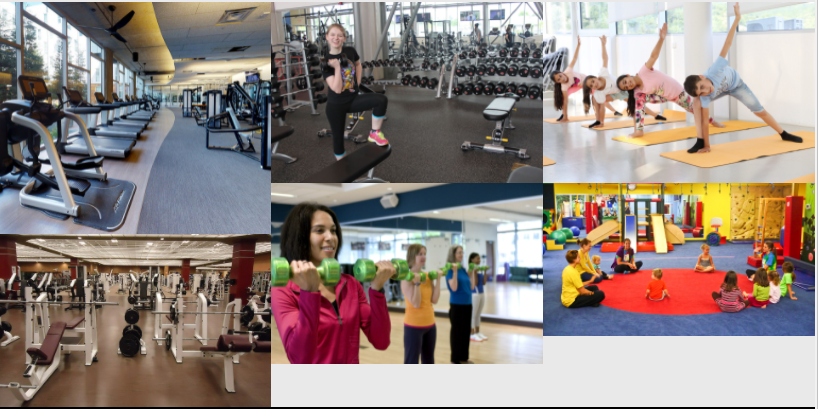
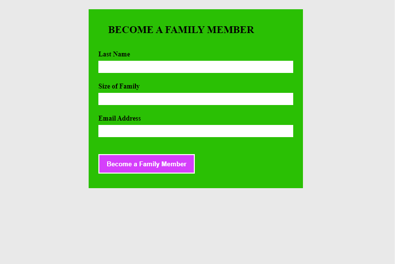
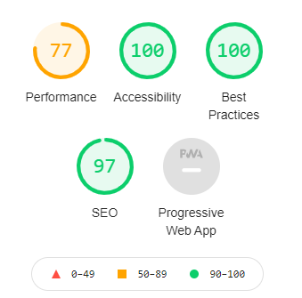

# The family gym

The family gym website is targeted towards families who want to go the gym together or separately using one family membership. The gym also provide child care for small children. The website provide information about the gym and an online form to become a member.

## Features

- Navigation

    The navigation is at the top of the page. To the left is the name of the gym and it links to the home page. To the right, "home" also links to the home page, "facilities" links to a gallery of pictures showing some of the gym's facilities, and "join" links to a form to become a family member.

    

- The About section

    The About section in the home page provide information about what is unique to the family gym so the users can immediately see if the gym is interesting for them.

    
- The footer

    The footer shows the gym's opening times and has also social media links.

    
- The gallery

    The gallery opens in a separate page which shows the facilities and activities available at the gym.

    
- The form

    The form also opens in a separate page and collects the family name, the size of the family and an email address, and offers a family membership to the gym.

    

## Testing

- I tested the internal links between the pages and confirmed that they work.
- I tested that the form works correctly. In particular it checks if one enters a number (between 1 and 100) and that the email address has the correct format.
- I tested the responsiveness of the website for different screen sizes.

### Bugs

One link did not work because I forgot to change the placeholder text to a link

### Validator testing

No errors were found with the W3C validator for both html and css files.

### Accessibility

The accessibility score for my code was 100% according to lighthouse in devtools.

### Unfixed bugs

No unfixed bugs

## Deployment
The site was deployed to GitHub pages. The steps to deploy are as follows:
* In the GitHub repository, navigate to the Settings tab and Pages link.
* From the source section drop-down menu, select the Master or Main Branch
* Once the Main branch has been selected, the page will be automatically refreshed with a detailed ribbon display to indicate the successful deployment.
Here is the link to the project:
 [The Family Gym](https://faridjos.github.io/project-html-css/index.html)

## Credits
I took inspiration from the walkthrough project Love Running. I reused som code from there but I mainly wrote my own code. 